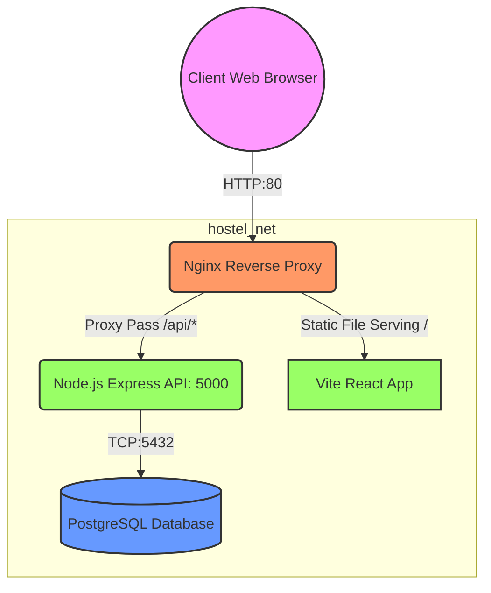

# HostelOps Architecture Diagram

## Request Flow Explanation
1. **[Client] -> [Nginx]**: The user navigates to `http://localhost/` or requests `http://localhost/api/complaints`. Nginx running in a Docker container receives this request.
2. **[Nginx] -> [Vite React App]**: If the request is for the root or an asset, Nginx reads it from its statically compiled pool (`/usr/share/nginx/html`).
3. **[Nginx] -> [Backend API]**: If the request begins with `/api/`, Nginx acts as a reverse proxy, forwarding headers and the request over the internal Docker network to the Express.js Backend Container.
4. **[Backend API] -> [DB]**: The backend logic translates the API request into a SQL Query, passing it to the PostgreSQL Database running in its own container on port 5432.
